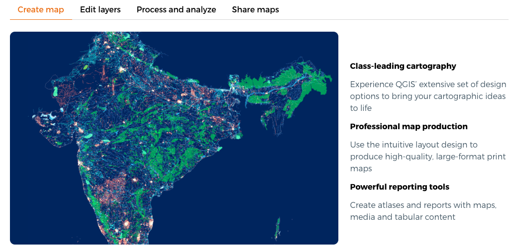

## `tabs` Shortcode



The `tabs` shortcode is used to create a tabbed interface where content can be organized into separate tabs that can be toggled without reloading the page.

### Parameters

- `tab1`, `tab2`, `tab3`, `tab4`: The titles of the tabs. You can define up to four tabs.

### Example Usage

To use the `tabs` shortcode, you need to pass the titles of the tabs as parameters. Here's an example with two tabs:

```html

```

This will generate a tabbed interface with two tabs named "First Tab" and "Second Tab".

### JavaScript Functionality
The tabs are managed through JavaScript. When a tab is clicked, the openTab function is called, which hides all other tab contents and shows the content of the clicked tab. It also updates the active state of the tabs.

### Additional Notes
The tabs are identified by id attributes in the format tab-X, where X is the tab number.
The corresponding tab content should have an id attribute in the format content-tab-X.
Only the first tab is displayed by default; the rest are hidden until their corresponding tab is clicked.
Ensure that the tab titles are unique and descriptive of the content they contain.